# Football Scorers Analyzer

The Football Scorers Analyzer is an application designed to help football enthusiasts analyze and identify trends in football scorers' performance. The application provides functionalities to summarize the data, show descriptive statistics, and visualize the data through distribution graphs.
## Application Features

- **Data Storytelling :** Summarize the data by using descriptive statistics, correlation, and performance and trends analysis. 

- **Descriptive Statistics:** Show descriptive statistics such as mean, median, min, max, etc., for different attributes of football scorers' data.

- **Correlation:** Show the correlation between goals with other attributes like expected goals, shots, and on-target shots.

- **Distribution Graph:** Show distribution graphs for attributes including goals, expected goals, shots, and on-target shots to understand the distribution of data.

- **Performance and Trends:** Analyze the performance of football players to identify trends and also compare the performance of players.

- **Navigation Bar:** Navigate between different functionalities and features of the application.

## Data Source

The data used in the application is collected from the [Kaggle dataset](https://www.kaggle.com/datasets/mohamedhanyyy/top-football-leagues-scorers) 
which contains the top football leagues' scorers data.

## Project Documentation

- [Project Proposal](https://docs.google.com/document/u/1/d/11GfCmdhIuwnw_fvwifCMMZNW5HYeveySgrKEX4Kjl6M/edit?usp=gmail_thread)
- [UML Class Diagram and Sequence Diagram](https://github.com/PatChirapat/Football-Scorer-Analyzer/wiki/UML-Class-Diagram-And-Sequence-Diagram)
- [Project Presentation](https://youtu.be/z_gTyegpTCI)
- [Wiki](https://github.com/PatChirapat/Football-Scorer-Analyzer/wiki)

## GitHub Repository

- [Football Scorers Analyzer](https://github.com/PatChirapat/Football-Scorer-Analyzer)

## User Interface

### Initial Application Screen
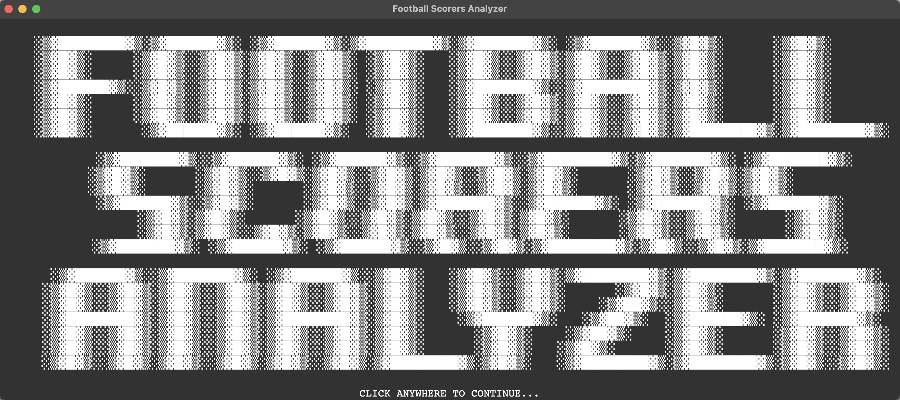

### Home Page
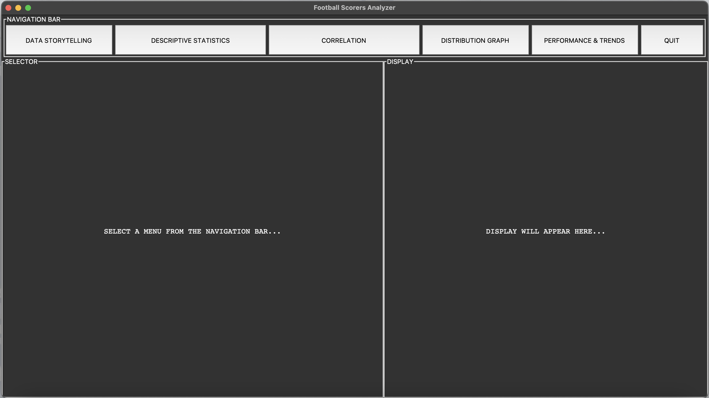

### Data Storytelling
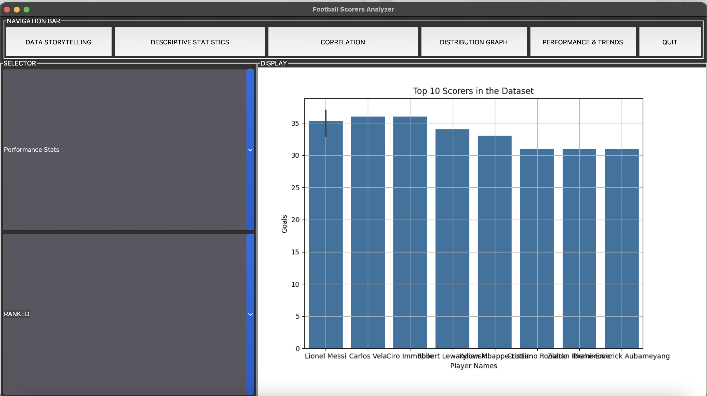

### Descriptive Statistics
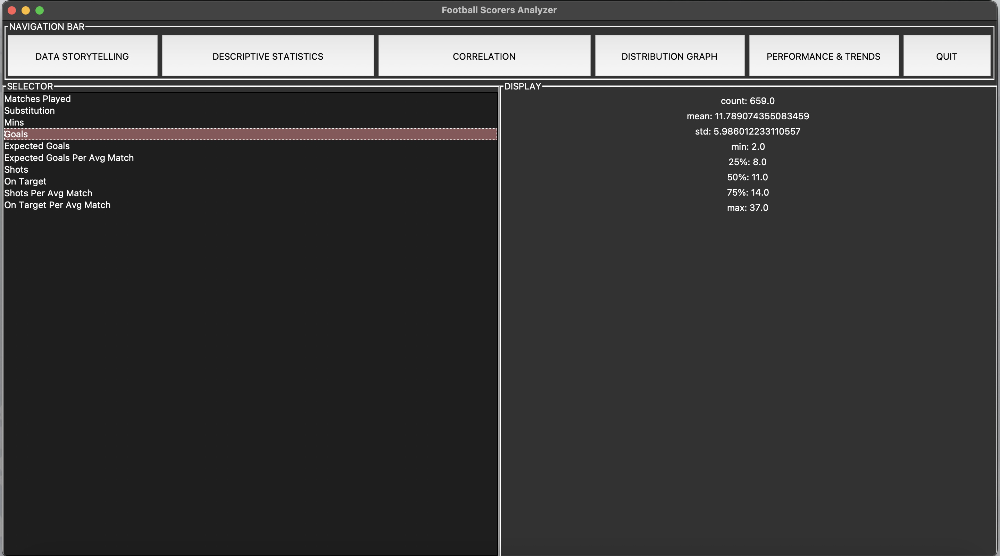

### Correlation
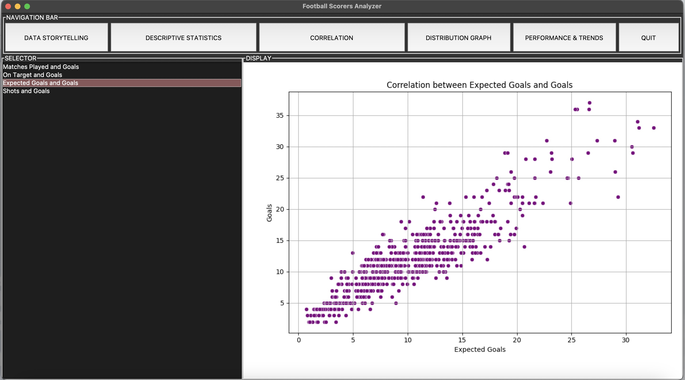

### Distribution Graph
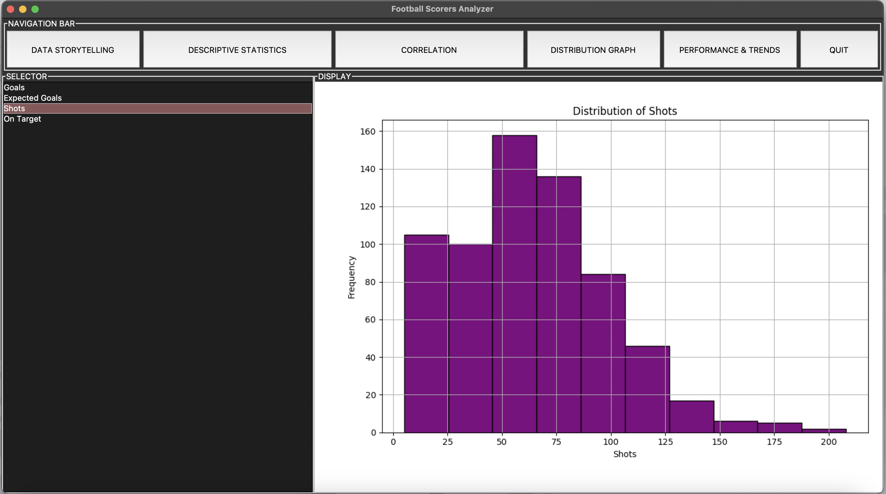

### Performance and Trends
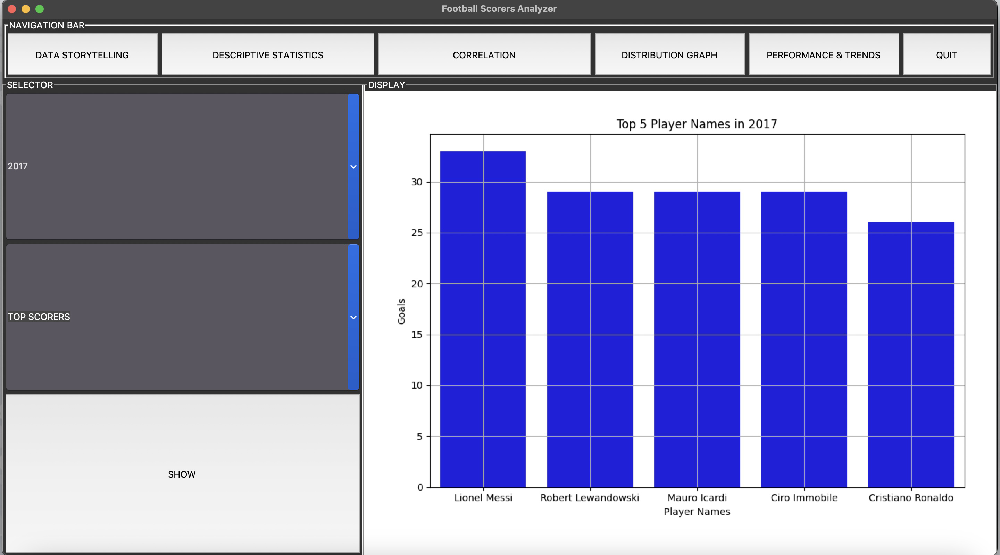
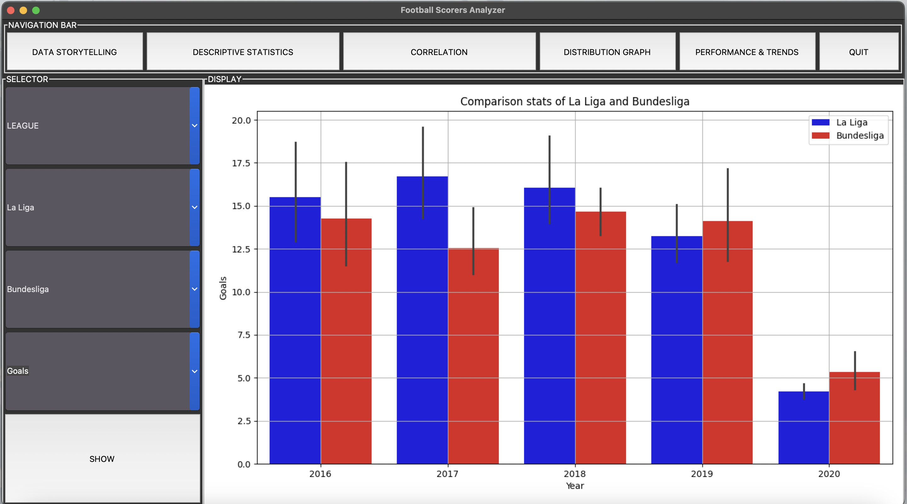
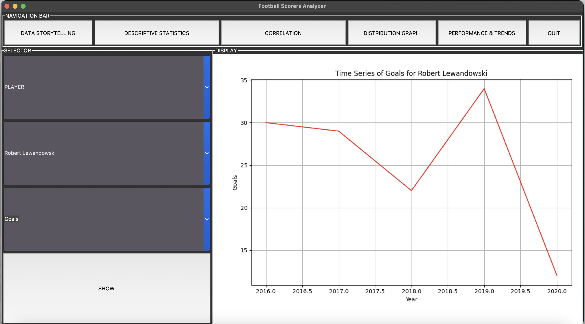

## UML Class Diagram and Sequence Diagram

### UML Class Diagram
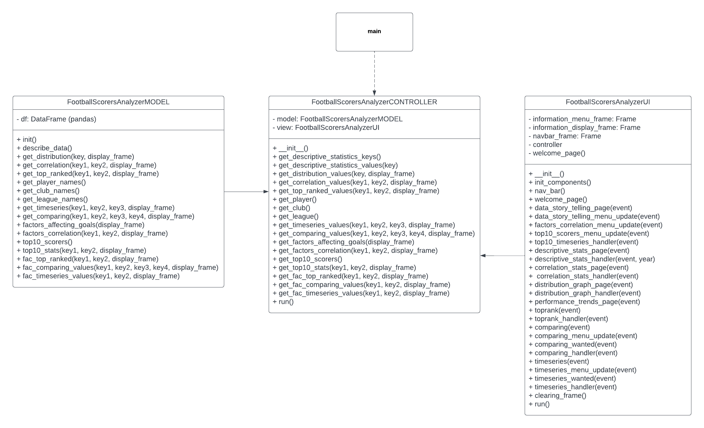

### Sequence Diagram
### Correlation Sequence Diagram
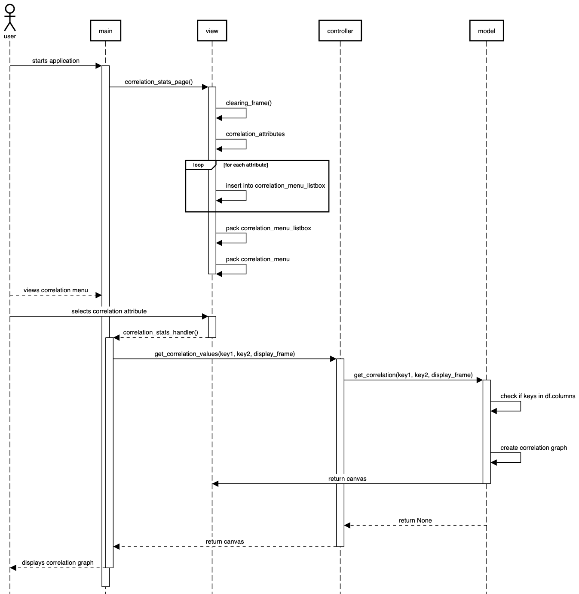

### Distribution Sequence Diagram
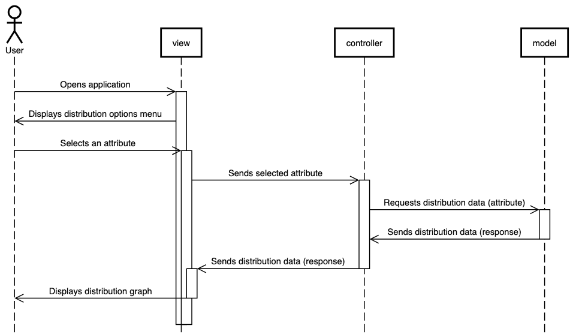

### Timeseries Sequence Diagram
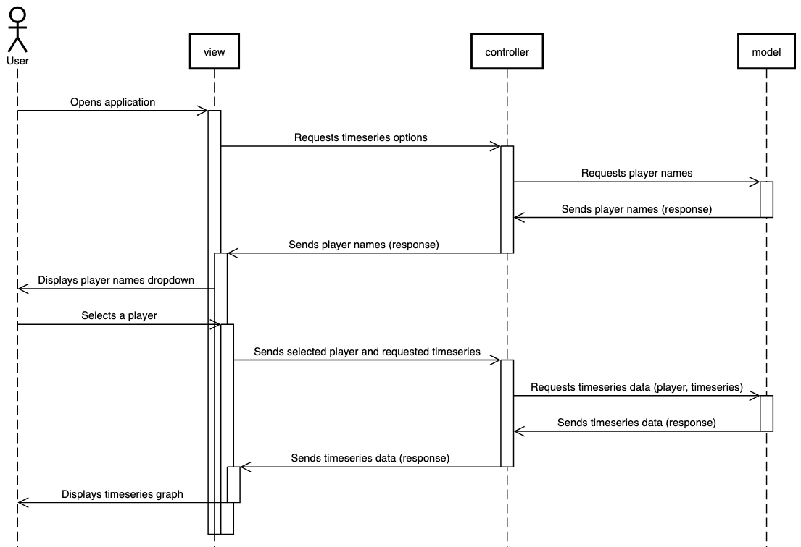

### Top Ranked Sequence Diagram


## Requirements

- Python 3.10 or higher
- Required Python packages specified in `requirements.txt`
  - pandas
  - matplotlib
  - numpy
  - seaborn

## Installation and Usage

1. Clone the repository:
   ```bash
   git clone https://github.com/PatChirapat/Football-Scorer-Analyzer.git
    ```
2. Change the directory:
   ```bash
   cd Football-Scorer-Analyzer
   ```
3. Create a virtual environment:
   for Windows:
   ```bash
    python -m venv venv
    venv\Scripts\activate
    ```
    for MacOS/Linux:
    ```bash
    python3 -m venv venv
    source venv/bin/activate
    ```
4. Install the required packages:
    ```bash
    pip install -r requirements.txt
    ```
5. Run the application:
    ```bash
    python main.py
    ```
   